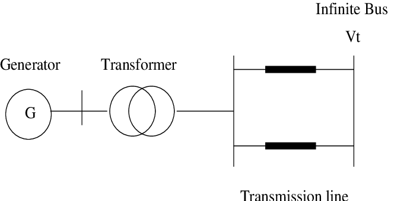

# Equal Area Criterion
## Kanwardeep Singh

### Associate Professor and H.O.D., 
### Department of Electrical Engineering,
### Guru Nanak Dev Engineering College, Ludhiana, Punjab, India

## Important Topics

1. Steady State Stability 
2. Transient Stability
3. Swing Equation
4. Numerical Solution

| Sr. No. | Item        | Description        |
| ------- | ----------- | -------------------|
| 1       | M           | Inertia Constant   |
| 2       | Pm          | Mechanical Input   |
| 3       | Pe          | Electrical Output  |
| 4       | Pa          | Accelerating Power |

[Click me!](https://www.youtube.com/watch?v=uDF3rPhhMjg)

- Enjoy Studies
- Team work
- and ...
